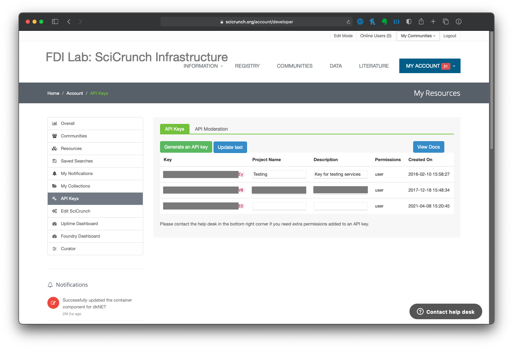

# Getting Started with SPARC APIs

SPARC APIs and associated services provided by the FAIR Data Informatics Laboratory at the University of California, San Diego.  Access to APIs is provided via scicrunch.org. In order to gain access to the APIs please follow the steps below to get your API key.

#### Create an account at [scicrunch.org](https://scicrunch.org)

Go to https://scicrunch.org and select 'Register'

#### Create your API Key

After you have created your account and verified your email you can then create your API.  First login to the [scicrunch.org portal](https://scicrunch.org). After you are logged in you can select _**API Keys**_ under _**MY ACCOUNT**_.

Once you select _**API Keys**_ you will be asked to re-verify your password.

Once you have entered your password you will be taken to your API dashboard.

From the dashboard you can view your current API keys and can generate an API Key.  The generate a new key select _**Generate an API Key**_. A new key will then be added to your dashboard.  To add information to your API key such as the project for which this API key is to be used in and a description - just fill out the information in the available text boxes and select _**Update Text**_.

Now that you have your API key you can explore specific SPARC APIs in the following sections.

